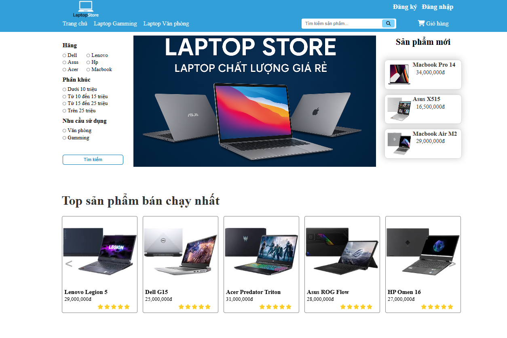

# Laptop Store - Website Bán Laptop

Dự án Website Bán Laptop là một nền tảng thương mại điện tử toàn diện, chuyên biệt trong lĩnh vực kinh doanh sản phẩm laptop. Mục tiêu của dự án là cung cấp một giải pháp hiệu quả cho việc mua bán laptop trực tuyến, với trọng tâm vào trải nghiệm người dùng tối ưu, quản lý sản phẩm hiệu quả và quy trình giao dịch nhanh chóng và an toàn. Dự án được phát triển dựa trên các nguyên tắc phân tích thiết kế hệ thống hiện đại, quản lý cơ sở dữ liệu mạnh mẽ và kỹ thuật lập trình web hiện đại.

## Mục lục

- [Giới thiệu](#giới-thiệu)
- [Công nghệ sử dụng](#công-nghệ-sử-dụng)
- [Các tính năng](#tính-năng)
- [Cài đặt và Chạy dự án](#cài-đặt-và-chạy-dự-án)

## Giới thiệu

**Website Bán Laptop** là một nền tảng thương mại điện tử chuyên nghiệp được thiết kế để tối ưu hóa quy trình kinh doanh laptop. Website cung cấp giao diện trực quan và thân thiện, cho phép khách hàng dễ dàng xem, tìm kiếm sản phẩm và thực hiện các giao dịch mua bán một cách thuận tiện. Đồng thời, hệ thống còn trang bị một bộ công cụ quản trị mạnh mẽ cho phép quản trị viên (chủ cửa hàng) dễ dàng quản lý toàn bộ website, từ sản phẩm, đơn hàng đến thông tin khách hàng, nhằm đảm bảo vận hành trôi chảy và hiệu quả.

## Công nghệ sử dụng

* **Frontend:** HTML, CSS, JavaScript
* **Backend:** PHP
* **Cơ sở dữ liệu:** MySQL (Thông qua XAMPP)
* **Môi trường phát triển:** XAMPP (bao gồm Apache Web Server)

## Tính năng

Website cung cấp các tính năng đầy đủ cho cả người dùng cuối (khách hàng) và quản trị viên, đảm bảo trải nghiệm mua sắm mượt mà và quản lý hệ thống hiệu quả.

### 1. Đối với Khách hàng

* **Quản lý tài khoản:**
    * Đăng ký tài khoản mới bằng số điện thoại.
    * Đăng nhập/Đăng xuất an toàn.
* **Duyệt và Tìm kiếm sản phẩm:**
    * Xem danh sách các sản phẩm laptop đa dạng.
    * Tìm kiếm sản phẩm nhanh chóng qua ô tìm kiếm.
    * Lọc sản phẩm theo các tiêu chí như hãng, mức giá, nhu cầu sử dụng, v.v.
* **Thông tin sản phẩm chi tiết:**
    * Xem mô tả chi tiết, thông số kỹ thuật đầy đủ của từng sản phẩm.
    * Đọc các bài đánh giá (nếu có) từ những khách hàng khác.
* **Giỏ hàng và Đặt hàng:**
    * Thêm/Bớt sản phẩm vào giỏ hàng.
    * Thực hiện quy trình đặt hàng đơn giản và nhanh chóng.
    * Xem lịch sử và trạng thái chi tiết của các đơn hàng đã đặt.

### 2. Đối với Quản trị viên (Admin)

* **Quản lý Đơn hàng:**
    * Xem danh sách tất cả các đơn hàng.
    * Xem chi tiết từng đơn hàng (sản phẩm, thông tin khách hàng, tổng tiền).
    * Cập nhật trạng thái đơn hàng (ví dụ: Hoàn thành, Hủy).
* **Quản lý Sản phẩm:**
    * Thêm sản phẩm mới vào danh mục.
    * Chỉnh sửa thông tin, giá cả, số lượng tồn kho của sản phẩm hiện có.
    * Xóa sản phẩm không còn kinh doanh.
* **Quản lý Người dùng:**
    * kích hoạt hoặc vô hiệu hóa tài khoản
    * Xóa tài khoản người dùng không hợp lệ hoặc theo yêu cầu.

## Cài đặt và Chạy dự án

Để chạy dự án Website Bán Laptop trên máy tính cục bộ của bạn, bạn cần có môi trường XAMPP đã được cài đặt.

### Yêu cầu hệ thống

* **XAMPP:** Phiên bản hỗ trợ PHP, MySQL (ví dụ: XAMPP v7.x hoặc v8.x).

### Các bước cài đặt

1.  **Cài đặt XAMPP:**
    * tải và cài đặt XAMPP từ trang chủ chính thức: [https://www.apachefriends.org/index.html](https://www.apachefriends.org/index.html)
    * Sau khi cài đặt, khởi động **XAMPP Control Panel**.
    * Khởi động **Apache** và **MySQL** modules bằng cách ấn start cả hai

2.  **Clone (hoặc tải về) Repository:**
    * Mở Terminal (hoặc Command Prompt/Git Bash).
    * Điều hướng đến thư mục `htdocs` của XAMPP (thường là `C:\xampp\htdocs` trên Windows, hoặc `/Applications/XAMPP/htdocs` trên macOS).
    * Clone dự án của bạn vào thư mục mới:
        ```bash
        git clone https://github.com/MD1809/Nhom9_KTPM.git
        ```

3.  **Tạo và Cấu hình Cơ sở dữ liệu:**
    * Mở trình duyệt web và truy cập vào **phpMyAdmin**: [http://localhost/phpmyadmin](http://localhost/phpmyadmin)
    * Trong phpMyAdmin, nhấp vào tab **"Cơ sở dữ liệu" (Databases)**.
    * Tạo một cơ sở dữ liệu mới
    * Nhấp vào cơ sở dữ liệu vừa tạo.
    * Nhấp vào tab **"Nhập" (Import)**.
    * Chọn file `.sql` (Trong laptop_store/database)
    * Nhấp vào **"Thực hiện" (Go)** để nhập dữ liệu.

4.  **Cấu hình kết nối Cơ sở dữ liệu trong dự án:**
    * Tìm file `config.php` trong thư mục dự án vừa tạo của bạn (Trong laptop_store/settings)
    * Mở file này bằng trình soạn thảo mã và cập nhật thông tin kết nối cơ sở dữ liệu nếu cần thiết:
        ```php
        <?php
            $server = "localhost"; // Máy chủ cơ sở dữ liệu
            $username = "root"; // Tên người dùng MySQL mặc định của XAMPP
            $passwordroot = ""; // Mật khẩu MySQL mặc định của XAMPP (thường là trống)
            $database = "laptop_store"; // sửa tên cơ sở dữ liệu giống với bạn tạo (nếu có)

            // Kết nối đến MySQL với PHP sử dụng MySQLi
            $conn = new mysqli($server, $username, $passwordroot, $database);

            // Kiểm tra kết nối
            if ($conn->connect_error) {
                die("Kết nối thất bại: " . $conn->connect_error);
            }

            // Thiết lập bộ ký tự cho kết nối
            $conn->set_charset("utf8mb4");
        ?>

5.  **Chạy ứng dụng:**
    * Mở trình duyệt web.
    * Gõ địa chỉ sau vào thanh địa chỉ để truy cập website của bạn:
        ```
        http://localhost/Tên thư mục dự án của bạn/index.php
        ```
    * Giao diện chính của website

    